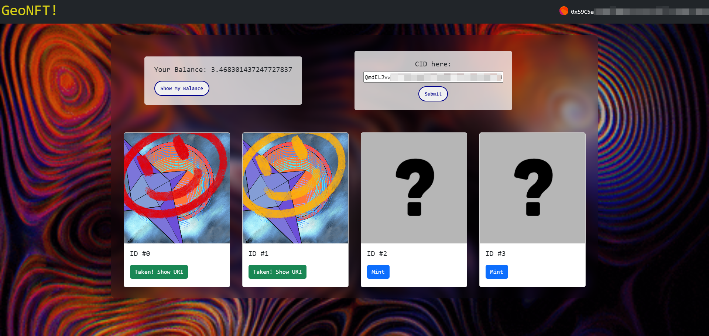

# Getting Started with Create React App

This project was bootstrapped with [Create React App](https://github.com/facebook/create-react-app).

This is a project which uses Remix to deploy NFT contract on Sepolia Testnet and uses React to create a user interface for users of this NFT.

The website looks like: 

## Available Scripts

To launch the website, run:

### `npm start`

Runs the app in the development mode.\
Open [http://localhost:3000](http://localhost:3000) to view it in your browser.

